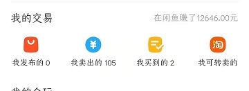

# 自我介绍
```js
Name: 周玉川
Major: 电子科技大学-信息与软件工程学院-互联网安全
Birth: 2000-04-29
Hometown: 河南-驻马店
website: https://myhoney.club/
```
## 大学期间
### 大一
- 四川省数学竞赛二等奖
- 学习C语言、数据结构、ACM算法，对计算机科学比较感兴趣，富有激情
- 通过4/6级
- 排名 15/128，国家励志奖学金，优秀学生奖学金

### 大二
- 微信小程序西南赛区二等奖，和工作室同学一起做了校园论坛，本人负责个人信息以及微信认证模块
- Linux、编译技术、计组、JAVA、软件工程、操作系统、计网、数据库、汇编语言、密码学
- 排名 19/128，优秀学生奖学金

### 大三
- 成都字节跳动 前端开发实习生，2020-3 至 2020-7，招聘系统Web端自动化测试
- 在网络上接外包项目，实现经济独立
- 深入学习JS以及CSS，接触主流框架
- 保研排名 29/128 均分84.56，优秀学生奖学金

### 大四
- 顺利毕业，拿到成都蚂蚁金服以及抖音offer
- 保研23人，我排名29，有些遗憾，研毕业后选择考研，未工作

## 个人作品
- 小程序
  - 中科大校友会，排名、地图、校友圈、证书
  - 校园送水
- YuChuan_API Express写的免费API接口，主要有生成二维码、邮箱验证码、汉语转拼音、emojis表情等功能,https://api.myhoney.club/
- 毕业设计，动态数据可视化，前端`TS+React+Antd`，使用进行React的 `hook useReducer`进行状态管理，Echarts数据可视化, https://exhibition.myhoney.club/

## 自己不一样的点
- 平时学的东西比较杂，时间长难免忘记，所以有做笔记的习惯，这两年来也积累了很多，工具一般是`OneNote`
- 喜欢用程序思维解决生活中的难题，
- 在网上做过外包，主要写数据爬虫、C++控制台程序、数据结构算法实现以及帮别人改bug，自己又当技术又和客户对需求，比较累但是体会到了赚钱的快乐
<div align="center">  </div>

- 喜欢学习算法，尤其是和数学相关的，尽管比较菜，但leetcode也通过了200+了,https://leetcode-cn.com/u/yuchuanuestc/
- 平时会逛逛github，特别会留意下比较有创意的项目，比如今年比较火的`TailWindCSS`，前两天还给MDN的开源项目提了一个PR，帮他们修复了一些bug，个人主页 https://github.com/UESTCzhouyuchuan

## 个人缺点
偏科严重，政治相关的提不起兴趣
| 科目 | 成绩|
|-----|-----|
|C语言|95|
|C++|91|
|微积分1|92|
|微积分2|97|
|概率论|95|
|数据结构与算法|91|
|编译技术|91|
|毛中特|71|
|马克思主义|78|
|思修|71|
|中国近代史|78|
## 个人目标
1. 根据分配的任务，及时有效的完成需求
2. 成为一个全栈工程师
3. 与项目各个环节积累足够的开发经验，能够带领同事实现完整高效的系统，并且进行详细的系统设计
